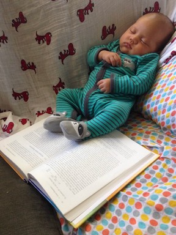

# ISL

[*An Introduction to Statistical Learning with applications in R*](http://www-bcf.usc.edu/~gareth/ISL/) [1] is a classic textbook written by Gareth James, Daniela Witten, Trevor Hastie and Robert Tibshirani. This repository contains my solutions to the labs and exercises, I follow in Python rather than R, with heavy use of: `numpy`, `pandas`, `sklearn`, `matplotlib`, `seaborn`, `patsy` and `statsmodels`.

## Quickstart

1. `git clone git@github.com:coxy1989/ISL.git`

2. `cd ISL`

3. `conda env create -f environment.yml`

4. `source activate isl`

5. `jupyter notebook`

### Run the notebooks

- [Chapter 2: Statistical Learning: Conceptual](https://nbviewer.jupyter.org/github/coxy1989/isl/blob/master/chapter_2/exercises.ipynb)
- [Bonus: The Curse of Dimensionality](https://nbviewer.jupyter.org/github/coxy1989/isl/blob/master/chapter_2/curse_of_dimensionality.ipynb)
- [Chapter 3: Linear Regression: Conceptual](https://nbviewer.jupyter.org/github/coxy1989/isl/blob/master/chapter_3/exercises_conceptual.ipynb)
- [Chapter 3: Linear Regression: Applied](https://nbviewer.jupyter.org/github/coxy1989/isl/blob/master/chapter_3/exercises_applied.ipynb)
- [Chapter 4: Classification: Conceptual](https://nbviewer.jupyter.org/github/coxy1989/isl/blob/master/chapter_4/exercises_conceptual.ipynb)
- [Chapter 4: Classification: Applied](https://nbviewer.jupyter.org/github/coxy1989/isl/blob/master/chapter_4/exercises_applied.ipynb)
- [Chapter 4: Classification: Lab](https://nbviewer.jupyter.org/github/coxy1989/isl/blob/master/chapter_4/lab.ipynb)
- [Chapter 5: Resampling Methods: Conceptual](https://nbviewer.jupyter.org/github/coxy1989/isl/blob/master/chapter_5/exercises_conceptual.ipynb)
- [Chapter 5: Resampling Methods: Applied](https://nbviewer.jupyter.org/github/coxy1989/isl/blob/master/chapter_5/exercises_applied.ipynb)
- [Chapter 5: Resampling Methods: Lab](https://nbviewer.jupyter.org/github/coxy1989/isl/blob/master/chapter_5/lab.ipynb)
- [Bonus: The Mean of Correlated Quatities](https://nbviewer.jupyter.org/github/coxy1989/isl/blob/master/chapter_5/notes.ipynb)
- [Chapter 6: Linear Model Selection & Regularization: Conceptual](https://nbviewer.jupyter.org/github/coxy1989/isl/blob/master/chapter_6/conceptual.ipynb)
- [Chapter 6: Linear Model Selection & Regularization: Applied](https://nbviewer.jupyter.org/github/coxy1989/isl/blob/master/chapter_6/applied.ipynb)
- [Chapter 6: Linear Model Selection & Regularization: Lab](https://nbviewer.jupyter.org/github/coxy1989/isl/blob/master/chapter_6/lab.ipynb)
- [Chapter 7: Moving Beyond Linearity: Conceptual](https://nbviewer.jupyter.org/github/coxy1989/isl/blob/master/chapter_7/conceptual.ipynb)
- [Chapter 7: Moving Beyond Linearity: Applied](https://nbviewer.jupyter.org/github/coxy1989/isl/blob/master/chapter_7/applied.ipynb)
- [Chapter 7: Moving Beyond Linearity: Lab](https://nbviewer.jupyter.org/github/coxy1989/isl/blob/master/chapter_7/lab.ipynb)
- [Chapter 8: Tree-Based Methods: Conceptual](https://nbviewer.jupyter.org/github/coxy1989/isl/blob/master/chapter_8/conceptual.ipynb)
- [Chapter 8: Tree-Based Methods: Applied](https://nbviewer.jupyter.org/github/coxy1989/isl/blob/master/chapter_8/applied.ipynb)
- [Chapter 8: Tree-Based Methods: Lab](https://nbviewer.jupyter.org/github/coxy1989/isl/blob/master/chapter_8/lab.ipynb)
- [Chapter 9: Support Vector Machines: Conceptual](https://nbviewer.jupyter.org/github/coxy1989/isl/blob/master/chapter_9/conceptual.ipynb)
- [Chapter 9: Support Vector Machines: Applied](https://nbviewer.jupyter.org/github/coxy1989/isl/blob/master/chapter_9/applied.ipynb)
- [Chapter 9: Support Vector Machines: Lab](https://nbviewer.jupyter.org/github/coxy1989/isl/blob/master/chapter_9/lab.ipynb)
- [Chapter 10: Unsupervised Learning: Conceptual](https://nbviewer.jupyter.org/github/coxy1989/isl/blob/master/chapter_10/conceptual.ipynb)
- [Chapter 10: Unsupervised Learning: Applied](https://nbviewer.jupyter.org/github/coxy1989/isl/blob/master/chapter_10/applied.ipynb)
- [Chapter 10: Unsupervised Learning: Lab](https://nbviewer.jupyter.org/github/coxy1989/isl/blob/master/chapter_10/lab.ipynb)

## References

[1] Gareth James, Daniela Witten, Trevor Hastie, Robert Tibshirani. An Introduction to Statistical Learning with Applications in R. New York Springer, 2013.

*This repository was split out from [mlsabattical](https://github.com/coxy1989/mlsabbatical) on 09/01/2018*
